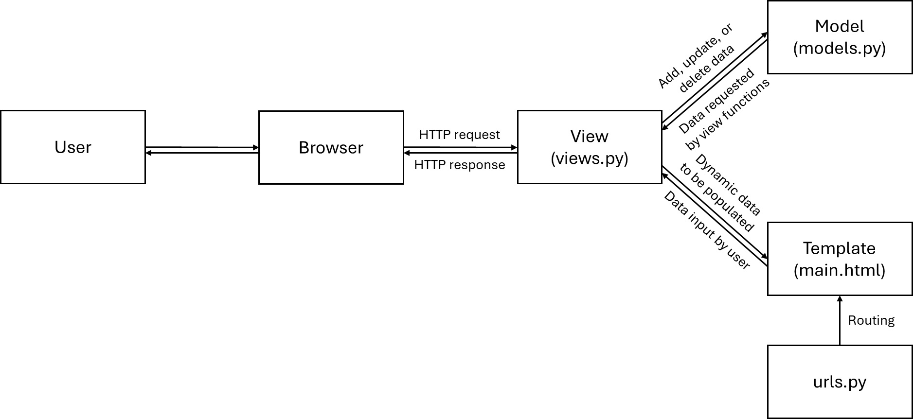
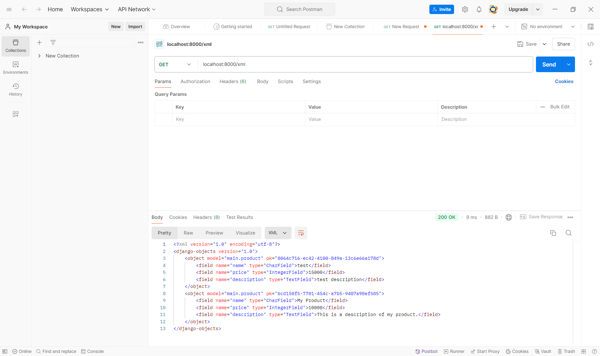
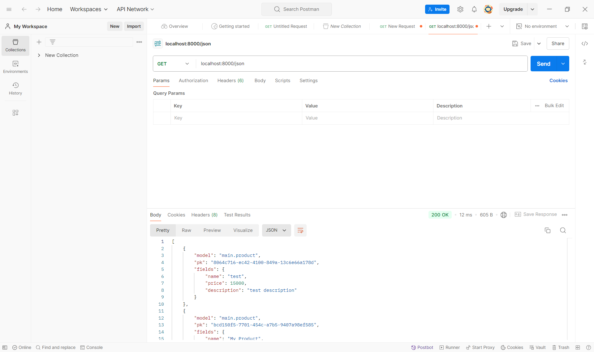
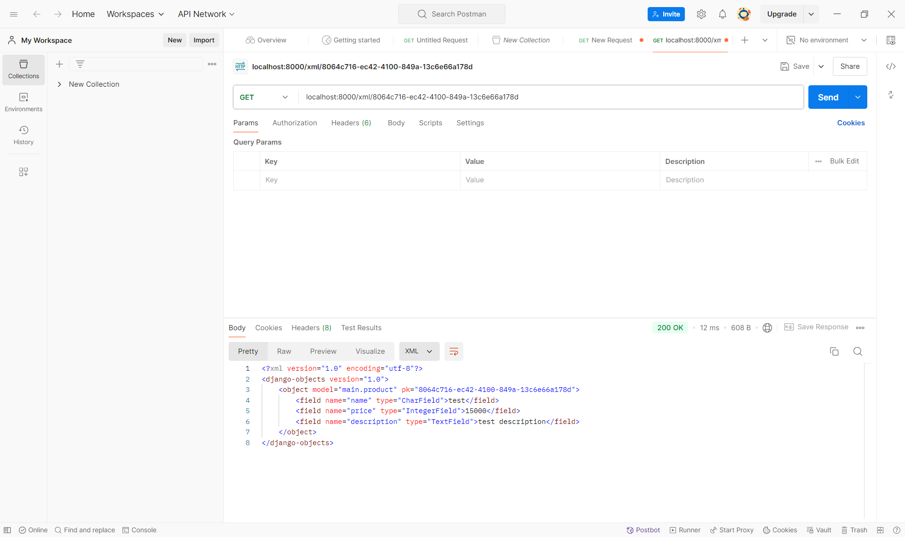
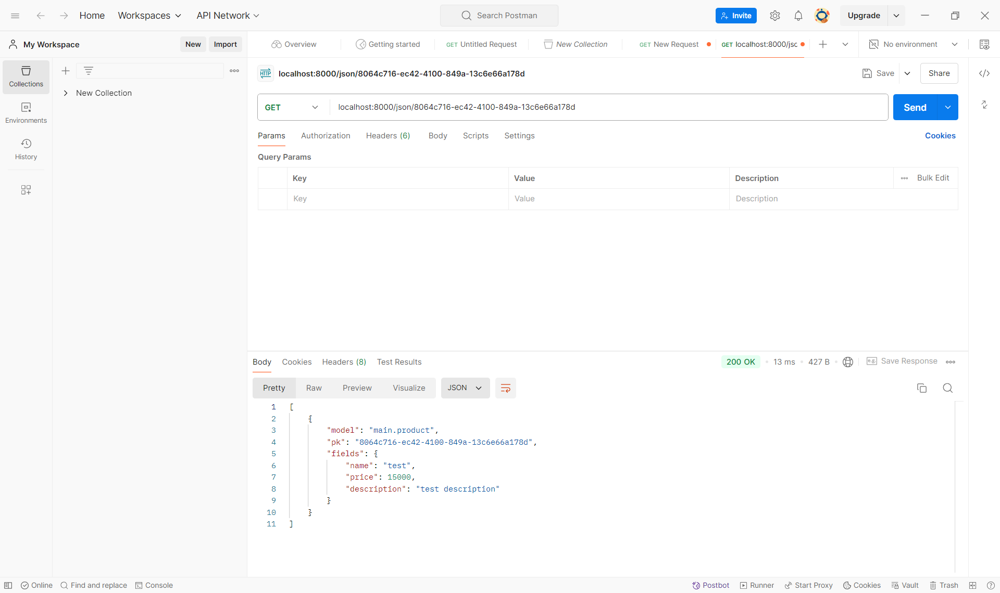

# E-Commerce Application (BryShop) - PBP Assignment 2 and 3

[Link to PWS application](http://bryant-warrick-ecommerce.pbp.cs.ui.ac.id/)

## Answer to Questions for Assignment 2

---

**Question: Explain how you implemented the checklist above step-by-step (not just following the tutorial).**

Answer:

1. I created a virtual environment using the command `python -m venv env`.
2. I activate the virtual environment using the command `env\Scripts\activate`.
3. I created a `requirements.txt` file with the following content:
```
django
gunicorn
whitenoise
psycopg2-binary
requests
urllib3
```
4. Inside the virtual environment, I ran the command `pip install -r requirements.txt`.
5. I created the Django project using the command `django-admin startproject e_commerce .`.
6. I added `"localhost"`, `"127.0.0.1"`, and `"bryant-warrick-ecommerce.pbp.cs.ui.ac.id"` in the `ALLOWED_HOSTS` on `settings.py`.
7. I added a `".gitignore"` file.
8. I created the `main` application by running `python manage.py startapp main` while the virtual environment is active.
9. Inside the `settings.py` in the `e_commerce` directory, I added `'main'` to the `INSTALLED_APPS` variable.
10. For routing for the `main` application, I created a new file named `urls.py` in the `main` directory.
11. Inside `urls.py`, I pasted the following content:
```
from django.urls import path
from main.views import show_main

app_name = 'main'

urlpatterns = [
    path('', show_main, name='show_main'),
]
```
12. Inside the `urls.py` of the `e_commerce` directory (not the `main` directory), I imported using `from django.urls import path, include`. After that, I added the following URL route in the `urlpatterns` variable: `path('', include('main.urls'))`
13. Creating the model: In the `models.py` file in the `main` directory, I filled it with the following code:
```
from django.db import models

class Product(models.Model):
    name = models.CharField(max_length=255)
    price = models.IntegerField()
    description = models.TextField()
```
14. I performed a model migration by running `python manage.py makemigrations` and `python manage.py migrate`.
15. In the `views.py` file inside the `main` directory, I filled it with the following code:
```
from django.shortcuts import render

# Create your views here.
def show_main(request):
    context = {
        "appname": "BryShop",
        "name": "Bryant Warrick Cai",
        "npm": "2306256255",
        "class": "KKI"
    }

    return render(request, "main.html", context)
```
16. I created a new file named `main.html` in the `templates` directory of the `main` directory. I filled it with:
```
<!DOCTYPE html>
<head>
    <title>BryShop</title>
</head>
<body>
    <h1>Welcome to {{ appname }}!</h1>
    <h3>Name:</h3>
    <p>{{ name }}</p>
    <h3>NPM:</h3>
    <p>{{ npm }}</p>
    <h3>Class:</h3>
    <p>{{ class }}</p>
</body>
```
17. I performed a deployment to PWS by creating a new project in PWS named `ecommerce`.
18. I pushed my project to PWS using `git push pws main:master`.

---

**Question: Create a diagram that contains the request client to a Django-based web application and the response it gives, and explain the relationship between `urls.py`, `views.py`, `models.py`, and the `html` file.**

Answer:



In Django, `urls.py` maps the URLS to functions or class-based views. When a user access a specific URL, Django checks to determine which view should process the request. `views.py` provides logic that handles the request. It can process requests, retrieve data from models, and renders the response using HTML (template) files. `models.py` defines the structure of the database using Django's ORM. The HTML template is used to define the structure and design that the end-users see. Templates can be inserted in HTML files, which uses `views.py` to fill in the templates.

---

**Question: Explain the use of git in software development!**

Answer: Git is a version control system that can be used to track changes in code and files over time. Git is very heavily used in software development, as it stores a complete history of all the changes in the project, allowing developers to review and revert the codebase. Git allows collaboration on projects, and provides detailed logs for who made the specific changes, when, and why.

Git also enables developers to create branches, for separate lines of development. This allows testing and working on new features and bug fixes without affecting the main codebase. Once work on a branch is complete, the code can be merged back into the main branch. Code in Git can be stored in a remote repository (such as GitHub), where other collaborators can pull these changes to their local devices.

---

**Question: In your opinion, out of all the frameworks available, why is Django used as the starting point for learning software development?**

Answer: Django provides a comprehensive framework that simplifies many aspects of building web applications. Django already provides everything needed to build a web application out of the box, such as database management, user authentication, form handling, and URL routing. By learning Django, beginners can learn about both the frontend and backend aspects of web development. Django is also built in Python, which is usually considered a great programming language for beginners.

---

**Question: Why is the Django model called an ORM?**

Answer: ORM stands for Object-Relational Mapper. A Django model is called an ORM because it provides a way to interact with relational databases using object-oriented programming. ORM allows mapping Python objects (like Django models) to database tables.

---

## Answer to Questions for Assignment 3

---

**Question: Explain why we need data delivery in implementing a platform.**

Answer: Data delivery ensures that users can interact and receive content and information from the system. Data delivery enables dynamic content, maintains data consistency, and ensures secure transmission of the data. It also allows integration with external services to provide users with feedback and error handling, making the platform reliable and user-friendly.

---

**Question: In your opinion, which is better, XML or JSON? Why is JSON more popular than XML?**

Answer: In my opinion, I think JSON is better. JSON has a simpler and more human-readable structure than XML. JSON uses key-value pairs, whereas XML uses opening and closing tags with the data inside the tags. JSON format is more compact which leads to smaller file sizes. Parsing JSON is also faster due to its simple structure. JSON is also natively supported by JavaScript and many other programming languages.

---

**Question: Explain the functional usage of `is_valid()` method in Django forms. Also explain why we need the method in forms.**

Answer: In Django, the `is_valid()` method is used to check if the data submitted to the form adheres to the rules and constraints implemented by the form, such as field types, field length, and custom validation logic. In other words, `is_valid()` validates the data entered into the form. `is_valid()` is crucial because without it, there can be invalid or malicious data entered that bypasses these constraints, which may lead to errors or security vulnerabilities.

---

**Question: Why do we need `csrf_token` when creating a form in Django? What could happen if we did not use `csrf_token` on a Django form? How could this be leveraged by an attacker?**

Answer: The `csrf_token` in Django forms is an essential security feature to prevent CSRF (Cross-Site Request Forgery) attacks. This token is included in every form submission to ensure that a form submission is coming from a legitimate user, rather than by an attacker. Without this token, malicious websites can trick legitimate users to unknowingly submit requests to the legitimate website. (The malicious website has a script to submit a request to the legitimate website.)

---

**Question: Explain how you implemented the *checklist* above step-by-step (not just following the tutorial).**

Answer:

1. First I created a new directory named `templates` inside the root directory. Inside the `templates` folder, I created a new file named `base.html`. I filled it with the following content:
```

<!DOCTYPE html>
<html lang="en">
    <head>
        <meta charset="UTF-8" />
        <meta name="viewport" content="width=device-width, initial-scale=1.0" />
         
    </head>

    <body>
         
    </body>
</html>
```
2. Inside the `settings.py` file in the `e_commerce` directory, in the `TEMPLATES` variable, I modified the `dirs` to be `[BASE_DIR / 'templates']`.
3. I also made sure that the value of `APP_DIRS` is `True`.
4. I modified the `models.py` file in the `main` directory to import `uuid` and use a new UUID field, named `id` as the primary key of the object.
5. I did a model migration by running `python manage.py makemigrations` and `python manage.py migrate`.
6. I created a new file named `forms.py` in the `main` directory. I filled it with the following:
```
from django.forms import ModelForm
from main.models import Product

class ProductForm(ModelForm):
    class Meta:
        model = Product
        fields = ["name", "price", "description"]
```
7. I changed the contents of the `views.py` file in the `main` directory to:
```
from django.shortcuts import render, redirect
from main.forms import ProductForm
from main.models import Product

# Create your views here.
def show_main(request):
    products = Product.objects.all()
    context = {
        "appname": "BryShop",
        "name": "Bryant Warrick Cai",
        "npm": "2306256255",
        "class": "KKI",
        "products": products
    }

    return render(request, "main.html", context)

def create_product(request):
    form = ProductForm(request.POST or None)

    if form.is_valid() and request.method == "POST":
        form.save()
        return redirect('main:show_main')

    context = {'form': form}
    return render(request, "create_product.html", context)
```
8. Inside the `urls.py` file in the `main` directory, I changed the contents to:
```
from django.urls import path
from main.views import show_main, create_product

app_name = 'main'

urlpatterns = [
    path('', show_main, name='show_main'),
    path('create-product', create_product, name='create_product'),
]
```
9. I created a new HTML file named `create_product.html` in the `main/templates` directory. I filled the file with:
```
 

<h1>Add New Product</h1>

<form method="POST">
    
    <table>
        {{ form.as_table }}
        <tr>
        <td></td>
        <td>
            <input type="submit" value="Add Product" />
        </td>
        </tr>
    </table>
</form>


```
10. I changed the contents of the `main.html` file inside the `templates` folder of the `main` directory to:
```


<!DOCTYPE html>
<head>
    <title>BryShop</title>
</head>
<body>
    <h1>Welcome to {{ appname }}!</h1>
    <h3>Name:</h3>
    <p>{{ name }}</p>
    <h3>NPM:</h3>
    <p>{{ npm }}</p>
    <h3>Class:</h3>
    <p>{{ class }}</p>

    
    <p>There are no products in BryShop.</p>
    
    <table>
        <tr>
            <th>Name</th>
            <th>Price</th>
            <th>Description</th>
        </tr>

         This is how to display product data
         
        
        <tr>
            <td>{{product.name}}</td>
            <td>{{product.price}}</td>
            <td>{{product.description}}</td>
        </tr>
        
    </table>
    

    <br />

    <a href="">
        <button>Add New Product</button>
    </a>
</body>

```
11. On the `views.py` file inside the `main` directory, I added the following imports:
```
from django.http import HttpResponse
from django.core import serializers
```
12. I created a new function called `show_xml` in the `views.py` file, with the following content:
```
def show_xml(request):
    data = Product.objects.all()
    return HttpResponse(serializers.serialize("xml", data), content_type="application/xml")
```
This allows viewing the data in XML.
13. I created a new function called `show_json` in the `views.py` file, with the following content:
```
def show_json(request):
    data = Product.objects.all()
    return HttpResponse(serializers.serialize("json", data), content_type="application/json")
```
This allows viewing the data in JSON.
14. On `urls.py`, I imported `show_xml` and `show_json` inside from `main.views`, and created two new URL paths: `path('xml/', show_xml, name='show_xml')` for XML and `path('json/', show_json, name='show_json')` for JSON.
15. I then created a new function called `show_xml_by_id` in `views.py` for showing XML data only for a specific UUID.
```
def show_xml_by_id(request, id):
    data = Product.objects.filter(pk=id)
    return HttpResponse(serializers.serialize("xml", data), content_type="application/xml")
```
16. I then created a new function called `show_json_by_id` in `views.py` for showing JSON data only for a specific UUID.
```
def show_json_by_id(request, id):
    data = Product.objects.filter(pk=id)
    return HttpResponse(serializers.serialize("json", data), content_type="application/json")
```
17. On `urls.py`, I imported `show_xml_by_id` and `show_json_by_id` inside from `main.views`, and created two new URL paths: `path('xml/<str:id>/', show_xml_by_id, name='show_xml_by_id')` for XML and `path('json/<str:id>/', show_json_by_id, name='show_json_by_id')` for JSON.

### Screenshots of Postman









---

## Answer to Questions for Assignment 4

---

**Question: What is the difference between `HttpResponseRedirect()` and `redirect()`?**

Answer: `HttpResponseRedirect` is a class, and it requires you to provide the URL to which you want to redirect the user. On the other hand, `redirect` is a function, and can be more flexible. With `redirect`, it can take a variety of arguments other than a URL, such as a view name or a model instance.

---

**Question: Explain how the `MoodEntry` model is linked with `User`!**

Answer: The `Product` model has a foreign key to connect to the username of the logged in user, stored in the built-in `User` model. With this way, each object also has a user associated to it, so that users can only see the items they have added to the database, not other users' items.

---

**Question: What is the difference between *authentication* and *authorization*, and what happens when a user logs in? Explain how Django implements these two concepts.**

Answer: Authentication is the process of verifying the identity of the user on a system. Authorization is the process of determining the actions that an authenticated user are allowed to perform. Authorization ensures that users can only have access to the actions that they are permitted to.

When a user logs in, they submit their credentials (username and password). The server then checks these credentials with their database. If the credentials are valid, the user is authenticated, and the system establishes a session for the user, which stores the user's identity. This session allows the user to remain logged in, so that users don't need to enter their details every time for every page they visit. The system then checks for the user's permissions (authorization) for the actions they are allowed to do, to ensure that they don't access restricted areas or perform restricted actions.

Django has a built-in `User` model which represents each user in the system. This model contains fields such as username and password. Django provides the built-in functions to handle user authentication (logging in and out). Authorization in Django is handled through their permission system. Permissions can be created through models, and can be checked using methods like `user.has_perm()`. Django also provides groups, which can contain a collection of permissions that can be assigned to users.

---

**Question: How does Django remember logged-in users? Explain other uses of *cookies* and whether all cookies are safe to use.**

Answer: Django remembers logged-in users by using session cookies. When a user logs in, Django generates a session key, which is associated with the user's information and settings. This session cookie is sent to the user's browser. On subsequent requests, the browser sends the cookie back to the server, which allows Django to recognize the logged-in user.

Cookies are used in many things other than remembering logged-in users. They can store user preferences (such as language settings or theme choices), using a "persistent login" (remember me) feature, to allow users to keep logged in across different sessions, and can also be used for tracking user behavior and analytics.

---

**Question: Explain how did you implement the checklist *step-by-step* (apart from following the tutorial).**

Answer:

1. First, one the `views.py` file on the `main` directory, I added the following imports:
```
from django.contrib.auth.forms import UserCreationForm
from django.contrib import messages
```
2. I added a new `register` function on `views.py`. This function is used to create a user account when the form is submitted. The function is as follows:
```
def register(request):
    form = UserCreationForm()

    if request.method == "POST":
        form = UserCreationForm(request.POST)
        if form.is_valid():
            form.save()
            messages.success(request, 'Your account has been successfully created!')
            return redirect('main:login')
    context = {'form':form}
    return render(request, 'register.html', context)
```
3. In the `main/templates` directory, I created a new HTML file named `register.html`. I filled it with the following content:
```
 
<title>Register</title>
 

<div class="login">
    <h1>Register</h1>

    <form method="POST">
        
        <table>
            {{ form.as_table }}
            <tr>
                <td></td>
                <td><input type="submit" name="submit" value="Register" /></td>
            </tr>
        </table>
    </form>

    
    <ul>
        
        <li>{{ message }}</li>
        
    </ul>
    
</div>


```
4. On the `urls.py` file inside the `main` directory, I imported the `register` function from `main.views`.
5. On the same file, I added a new path to `urlpatterns`: `path('register/', register, name='register')`.
6. On the `views.py` file inside the `main` directory, I imported `AuthenticationForm` from `django.contrib.auth.forms` and also imported `authenticate` and `login` from `django.contrib.auth`.
7. Still on `views.py`, I created a new function called `login_user`, which is used to authenticate users when they log in. Content is as follows:
```
def login_user(request):
    if request.method == 'POST':
        form = AuthenticationForm(data=request.POST)

        if form.is_valid():
            user = form.get_user()
            login(request, user)
            return redirect('main:show_main')

    else:
        form = AuthenticationForm(request)
    context = {'form': form}
    return render(request, 'login.html', context)
```
8. In the `main/templates` directory, I created a new HTML file named `login.html`. I filled it with:
```



<title>Login</title>



<div class="login">
    <h1>Login</h1>

    <form method="POST" action="">
        
        <table>
        {{ form.as_table }}
        <tr>
            <td></td>
            <td><input class="btn login_btn" type="submit" value="Login" /></td>
        </tr>
        </table>
    </form>

    
    <ul>
        
        <li>{{ message }}</li>
        
    </ul>
     Don't have an account yet?
    <a href="">Register Now</a>
</div>


```
9. Inside the `urls.py` file inside the `main` directory, I imported the `login_user` function from `main.views`.
10. I added a new URL path to `urlpatterns` inside the `urls.py` file: `path('login/', login_user, name='login')`
11. On the `views.py` file in the `main` directory, I imported `logout` from `django.contrib.auth`.
12. I added a new function inside the `views.py` file called `logout_user`, which is used to log the user out.
```
def logout_user(request):
    logout(request)
    return redirect('main:login')
```
13. On the `main.html` file in the `main/templates` directory, I added a new "Logout" button at the end of the file.
```
<a href="">
    <button>Logout</button>
</a>
```
14. On the `urls.py` file, I imported the `logout_user` function that I just created on `views.py`.
15. I added `logout` as a new URL path.
16. On the `views.py` file, I imported `login_required` from `django.contrib.auth.decorators`.
17. I added a decorator of `@login_required(login_url='/login')` above the `show_main` function.
18. On the `views.py` file, I imported `datetime`, `HttpResponseRedirect` from `django.http`, and `reverse` from `django.urls`.
19. I updated the `login_user` function in `views.py` to set a cookie of the last login date and time. The result is as follows:
```
def login_user(request):
    if request.method == 'POST':
        form = AuthenticationForm(data=request.POST)

        if form.is_valid():
            user = form.get_user()
            login(request, user)
            response = HttpResponseRedirect(reverse("main:show_main"))
            response.set_cookie('last_login', str(datetime.datetime.now()))
            return response

    else:
        form = AuthenticationForm(request)
    context = {'form': form}
    return render(request, 'login.html', context)
```
20. In the `show_main` function, I added a new key in the `context` variable named `last_login`, which has the value of `request.COOKIES["last_login"]`.
21. I modified the `logout_user` function to also delete the `last_login` cookie. Final result:
```
def logout_user(request):
    logout(request)
    response = HttpResponseRedirect(reverse('main:login'))
    response.delete_cookie('last_login')
    return response
```
22. I added a new line inside the `main.html` file to show the last login data:
```
<h5>Last login session: {{ last_login }}</h5>
```
23. On the `models.py` file in the `main` directory, I added a new import: `from django.contrib.auth.models import User`
24. I added a new attribute to the `Product` entity, titled `user`, to identify the user in which each object belongs to. The new attribute is as follows:
```
user = models.ForeignKey(User, on_delete=models.CASCADE)
```
25. I modified the `create_product` function inside `views.py` to be as follows:
```
def create_product(request):
    form = ProductForm(request.POST or None)

    if form.is_valid() and request.method == "POST":
        product = form.save(commit=False)
        product.user = request.user
        product.save()
        return redirect('main:show_main')

    context = {'form': form}
    return render(request, "create_product.html", context)
```
26. In the `show_main` function, I modified the `products` variable to be `products = Product.objects.filter(user=request.user)` so that it only shows the products added by the logged-in user.
27. I also modified the `name` key in the `context` variable to be `request.user.username`.
28. I ran a model migration using `python manage.py makemigrations`.
29. I entered `1` twice during both prompts.
30. I ran `python manage.py migrate` to apply the migration in the previous step.
31. I ensured that my project is ready for a production environment. I added `import os` in the `settings.py` file on the `e_commerce` directory.
32. In the same file, I changed the variable `DEBUG` to this:
```
PRODUCTION = os.getenv("PRODUCTION", False)
DEBUG = not PRODUCTION
```

---
